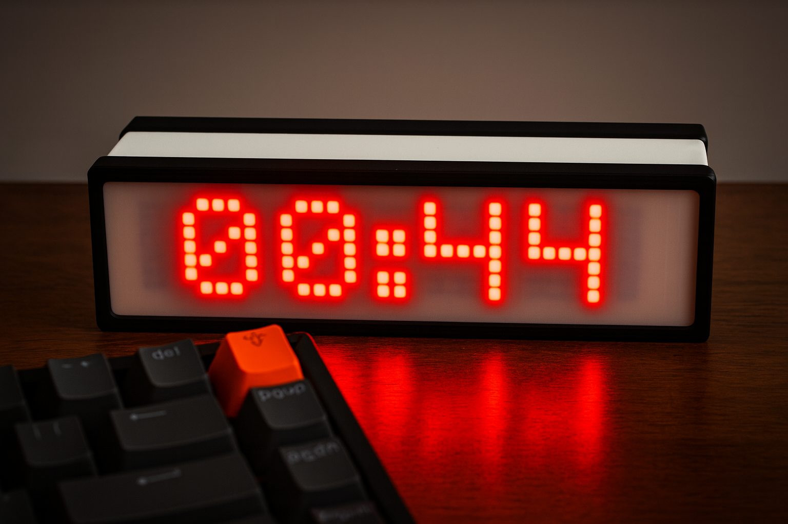
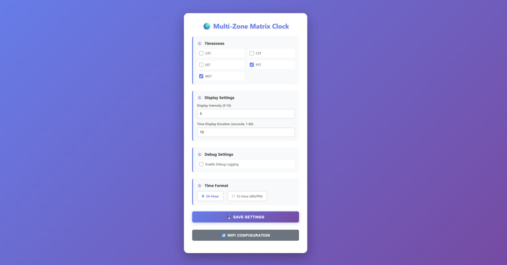

# Multi-Zone Matrix Clock

A WiFi-enabled LED matrix clock for ESP8266 that displays time from multiple timezones. Features automatic NTP synchronization, DST handling, and a web-based configuration interface.

 





## Features

- 🌍 **Multiple Timezone Support**: Display time from up to 6 different timezones (UTC, CST, EST, PST, IRST, and more)
- ⏰ **Automatic Time Sync**: NTP synchronization ensures accurate time
- 🌅 **DST Handling**: Automatic Daylight Saving Time adjustments for US timezones
- 📱 **Web Configuration**: Easy-to-use web interface for settings
- 🔌 **WiFi Manager**: Automatic WiFi configuration portal on first boot
- 🎨 **Customizable Display**: Adjustable brightness and 12/24-hour format
- 📺 **Animated Display**: Smooth scrolling animations for timezone names and time
- 💾 **Persistent Settings**: Settings saved to EEPROM

## Hardware Requirements

- **ESP8266** (NodeMCU, Wemos D1 Mini, or similar)
- **MAX7219 LED Matrix Display** (4 modules, FC16 hardware type)
- **Jumper wires** for connections
- **5V power supply** (USB or external adapter)

### Pin Connections

| ESP8266 Pin | MAX7219 Pin | Description |
|-------------|-------------|-------------|
| D5          | CLK         | Clock       |
| D7          | DIN         | Data In     |
| D8          | CS          | Chip Select |
| 5V          | VCC         | Power       |
| GND         | GND         | Ground      |

> **Note**: The pin definitions can be modified in `config.h` if needed.

## 3D Printing

This project includes 3MF files for 3D printing the enclosure and mounting components. All files are optimized for **Bambu Lab A1 Mini** and are located in the `stl/` directory.

### Available 3MF Files

| File | Description |
|------|-------------|
| `FRONT.3mf` | Front panel/enclosure |
| `FRONT Wemos D1 Mini.3mf` | Front panel with Wemos D1 Mini mounting |
| `BACK.3mf` | Back panel/enclosure |
| `FRAME FRONT.3mf` | Front frame component |
| `FRAME BACK.3mf` | Back frame component |
| `2 x MATRIX HOLDER.3mf` | Matrix display holder (print 2x) |

### Printing Instructions for Bambu Lab A1 Mini

1. **Open files in Bambu Studio** (or compatible slicer)
2. **Recommended settings**:
   - **Layer height**: 0.2mm (standard quality) or 0.16mm (fine quality)
   - **Infill**: 15-20% (sufficient for structural integrity)
   - **Supports**: Enable if needed (check model orientation)
   - **Material**: PLA or PETG recommended
3. **Print order**:
   - Start with the frame components (`FRAME FRONT.3mf`, `FRAME BACK.3mf`)
   - Print the front and back panels
   - Print 2x of the matrix holder
4. **Assembly**: Follow the component names to assemble the enclosure

### Notes

- All files are provided in 3MF format for easy import into Bambu Studio
- The models are designed to fit standard MAX7219 8x8 LED matrix modules
- Ensure proper clearance for the ESP8266 board and wiring
- You may need to adjust print settings based on your specific material and preferences

## Software Requirements

### Arduino IDE Libraries

Install the following libraries via Arduino IDE Library Manager:

1. **ESP8266WiFi** (included with ESP8266 board support)
2. **WiFiManager** by tzapu - [GitHub](https://github.com/tzapu/WiFiManager)
3. **MD_Parola** by majicDesigns - [GitHub](https://github.com/MajicDesigns/MD_Parola)
4. **MD_MAX72XX** by majicDesigns - [GitHub](https://github.com/MajicDesigns/MD_MAX72XX)
5. **NTPClient** by Fabrice Weinberg - [GitHub](https://github.com/arduino-libraries/NTPClient)
6. **WiFiUdp** (included with ESP8266 board support)
7. **EEPROM** (included with ESP8266 board support)

### Arduino IDE Setup

1. Install **Arduino IDE** (1.8.x or newer)
2. Add ESP8266 board support:
   - Go to `File` → `Preferences`
   - Add to Additional Board Manager URLs: `http://arduino.esp8266.com/stable/package_esp8266com_index.json`
   - Go to `Tools` → `Board` → `Boards Manager`
   - Search for "ESP8266" and install
3. Select your board: `Tools` → `Board` → `ESP8266 Boards` → `NodeMCU 1.0 (ESP-12E Module)` (or your specific board)
4. Set upload speed to `115200` in `Tools` → `Upload Speed`

## Installation

1. **Clone or download** this repository
2. **Open** `MultiZoneMatrixClock.ino` in Arduino IDE
3. **Install required libraries** (see Software Requirements above)
4. **Connect your hardware** according to the pin connections table
5. **Select your ESP8266 board** and COM port in Arduino IDE
6. **Upload** the sketch to your ESP8266

## First Time Setup

1. **Power on** the ESP8266
2. **Connect to WiFi**: The device will create a WiFi access point named `MultiZoneClock`
3. **Connect** to this network with your phone/computer
4. **Configure WiFi**: A portal will automatically open (or navigate to `192.168.4.1`)
5. **Enter your WiFi credentials** and connect
6. **Note the IP address** displayed in Serial Monitor (or check your router's connected devices)
7. **Access the web interface** by navigating to the IP address in your browser

## Configuration

### Web Interface

Access the web configuration interface by navigating to your ESP8266's IP address in a web browser.

**Settings available:**
- **Timezones**: Enable/disable which timezones to display
- **Display Intensity**: Adjust brightness (0-15)
- **Time Format**: Choose between 12-hour (AM/PM) or 24-hour format
- **WiFi Configuration**: Reconfigure WiFi connection

### Default Settings

- **Enabled Timezones**: EST, IRST
- **Display Intensity**: 5
- **Time Format**: 24-hour
- **Time Display Duration**: 10 seconds per timezone

### Manual Configuration

You can modify default settings in the code:

- **Timezones**: Edit `timezone.cpp` to add/modify timezones
- **Hardware pins**: Edit `config.h` to change pin assignments
- **Display settings**: Edit `config.h` for timing and display parameters

## Usage

### Display Behavior

- **Single Timezone Mode**: If only one timezone is enabled, the clock displays time statically with a blinking colon
- **Multiple Timezone Mode**: If multiple timezones are enabled:
  1. Timezone name scrolls up
  2. Brief pause
  3. Time scrolls in from left
  4. Time scrolls out to right
  5. Repeats for next enabled timezone

### Time Synchronization

- The clock automatically syncs with NTP servers (`pool.ntp.org`)
- Sync occurs periodically to maintain accuracy
- DST is automatically calculated and applied for US timezones

## Project Structure

```
MultiZoneMatrixClock/
├── MultiZoneMatrixClock.ino  # Main Arduino sketch
├── config.h                   # Configuration constants and settings structure
├── display.h                  # Display manager header
├── display.cpp                # Display manager implementation
├── timezone.h                  # Timezone manager header
├── timezone.cpp                # Timezone manager implementation
├── webserver.h                 # Web server manager header
├── webserver.cpp               # Web server manager implementation
├── stl/                        # 3D printing files (3MF format)
│   ├── FRONT.3mf
│   ├── FRONT Wemos D1 Mini.3mf
│   ├── BACK.3mf
│   ├── FRAME FRONT.3mf
│   ├── FRAME BACK.3mf
│   └── 2 x MATRIX HOLDER.3mf
└── README.md                   # This file
```

## Troubleshooting

### WiFi Connection Issues

- **Can't connect to AP**: Reset the device and try again
- **Portal doesn't open**: Manually navigate to `192.168.4.1`
- **Can't find device IP**: Check Serial Monitor output or your router's device list

### Display Issues

- **No display**: Check wiring connections, especially power and ground
- **Garbled text**: Verify pin connections match `config.h`
- **Too dim/bright**: Adjust intensity in web interface (0-15)

### Time Issues

- **Wrong time**: Ensure WiFi is connected and NTP sync is working
- **DST not working**: Check that timezone uses DST in `timezone.cpp`
- **Timezone offset wrong**: Verify timezone offset in `timezone.cpp`

### Serial Monitor

Enable Serial Monitor at `115200` baud to see debug information:
- WiFi connection status
- IP address
- NTP sync status
- Display state changes

## Customization

### Adding New Timezones

Edit `timezone.cpp`:

```cpp
// Add to timezones array
timezones[5] = {"TZNAME", offset_seconds, uses_dst};
```

Update `TZ_COUNT` in `config.h` if adding more than 6 timezones.

### Changing Display Hardware

Modify `config.h`:
- `HARDWARE_TYPE`: Change if using different MAX7219 module type
- `MAX_DEVICES`: Number of matrix modules
- Pin definitions: `CLK_PIN`, `DATA_PIN`, `CS_PIN`

## Technical Details

- **MCU**: ESP8266 (80MHz, 4MB Flash)
- **Display**: MAX7219 8x8 LED Matrix (4 modules = 32x8 display)
- **Protocol**: SPI for display communication
- **Storage**: EEPROM for settings persistence
- **Network**: WiFi 802.11 b/g/n
- **Time Protocol**: NTP (Network Time Protocol)

## License

This project is open source. Feel free to modify and distribute.

## Contributing

Contributions are welcome! Please feel free to submit a Pull Request.

## Acknowledgments

- Built with Arduino IDE and ESP8266
- Uses excellent libraries from the Arduino community
- Inspired by the need for a simple, multi-timezone clock

## Support

For issues, questions, or contributions, please open an issue on GitHub.

---

**Enjoy your Multi-Zone Matrix Clock!** ⏰🌍

